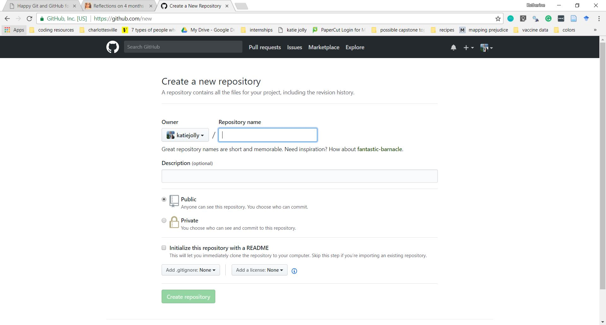

## How people use GitHub (not just storing code)

* Searching uses of different functions
* Finding new packages
* Sharing work
* Package development!
* Following interesting people (social media, but way more fun!)
* Q & A through issues
* Substituting for a long work history (and serving as a technical resume)
* Keeping knowledge wikis
* Small, static websites
  * I host my blog through GitHub!

## What you need to use GitHub well

I usually interact through GitHub through the `shell`, but to start out I think it's easier to use a Git client. For the purposes of this exercise we will use [Sourcetree](https://www.sourcetreeapp.com/).

1. Make a [GitHub](https://github.com/) account.
2. Install [Git](https://git-scm.com/).
3. Install [Sourcetree](https://www.sourcetreeapp.com/).
4. While you're at it, it's nice to have a good text editor. I highly recommend [Atom](https://atom.io/).

## Let's create your first repository!

1. Navigate to the homepage on GitHub. It should look something like this layout (with much less text most likely)

2. Either click the green `New Repository` button on the right side of the screen or the `+` and `New repository` on the top of the screen. You should now see a screen that looks like this.

3. Fill in the options as I've done below! The name is pretty optional, you'll probably delete this repository eventually anyway. Select to create a README as well!

4. Click `Create repository` at the bottom of the screen!

5. In the main page of the repository, click the green `Clone or download` button and copy the URL.

6. Navigate over to Sourcetree.

7. Click `Clone` at the top of the page. Your screen should look like this!

8. Select a location for your local repository. This should be its own folder. I'd recommend naming that repository the same way you named it on GitHub. Leave the other options the same for now.

9. Click the blue `Clone` button at the bottom of the screen.

10. You now have a local repository! Let's make a file and add it to GitHub.

### Push a file to GitHub.

1. Navigate to Atom!

2. Save the empty file as `test.md` in the new folder you created.

3. Write something in it! For example, what's a fun thing you've done in the last week?

4. Save that file. Go back over to Sourcetree.

5. You should see your new file in the `Unstaged files` section of the homepage of your folder.

6. Click on it to highlight it and then click `Stage selected`. It should now be in the `staged` section.

7. In the text box at the bottom of the screen under your name, write a short message! This should describe what you're pushing up to GitHub. For example, I wrote "first commit".

8. For ease, select the box that says `Push changes immediately to origin/master`. Then click `commit`!

9. Go check your repository on GitHub to make sure your new file is there!

## Other helpful things

1. Learn how to create branches for better workflow
2. Learn .gitignore files to manage sensitive or large items.
3. GitHub from RStudio/Atom

## Resources

* Suzan Baert's [Reflections of 4 months of GitHub](https://suzan.rbind.io/2018/03/reflections-4-months-of-github/)
* Jenny Bryan's [Happy Git with R](http://happygitwithr.com/) (beginner)
* Mike McQuaid's [Git in Practice](https://github.com/GitInPractice/GitInPractice#readme) (intermediate/advanced)
